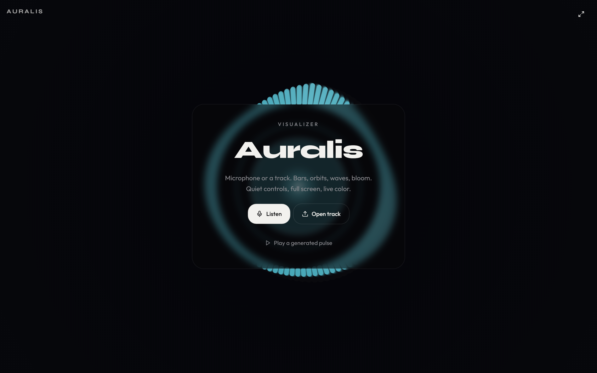

# Auralis

**Auralis turns microphone input or any track into living light** -- bars, orbits, waves, and bloom rendered in real time on a full-screen canvas stage.

Drop in an audio file, grant mic access, or let the built-in demo synth drive the visuals. Switch visualization modes, themes, and sensitivity from a HUD that fades away while you watch.




---

## Features

- **Three audio sources** -- microphone, a local audio file (drag & drop or pick), or a built-in demo synth.
- **Four visualization modes** -- `bars`, `orbit`, `wave`, `bloom`.
- **Four color themes** -- `ice`, `ember`, `tide`, `noir`.
- **Live HUD** -- mode, theme, sensitivity, volume, and fullscreen controls that auto-hide during playback and can be pinned.
- **Persisted preferences** -- mode, theme, sensitivity, volume, and HUD pin state survive reloads (local storage).
- **Fullscreen playback** with cross-browser fullscreen-change detection.
- **Installable PWA** -- web manifest, icons, and service-worker middleware.

---

## Tech Stack

| Area | Choice |
| --- | --- |
| Framework | TanStack Start + TanStack Router / Query / Table |
| UI | React 19, Tailwind CSS 4, Radix UI, Lucide icons |
| State | Zustand |
| Build | Vite 8 + Nitro |
| Data | Kysely + PGlite / `pg` |
| Auth | better-auth (~1.6) with JWT via `jose` |
| Language | TypeScript |

---

## Getting Started

### Prerequisites

- [Bun](https://bun.sh) (1.x) and Node.js (v22+ recommended)

### Install

```sh
bun install
```

### Develop

```sh
bun run dev
```

Serves the app on <http://localhost:8080> with hot reload.

### Build & run

```sh
bun run build      # production build + db migration
bun run preview    # preview the built output
```

---

## Scripts

| Command | Description |
| --- | --- |
| `bun run dev` | Start the dev server on port 8080 |
| `bun run build` | Production build, then run DB migrations |
| `bun run preview` | Preview the built output |
| `bun run preview:restart` / `preview:stop` | Manage the preview server |
| `bun run typecheck` | `tsc --noEmit` |
| `bun run lint` | ESLint |
| `bun run format` | Prettier write |
| `bun test` | Node test runner (scripts + unit tests) |
| `bun run check:auth` | Verify the auth invariant |
| `bun run db:migrate` | Apply migrations |

---

## Project Structure

```
.
+-- src/
|   +-- routes/                 # __root.tsx (app shell), index.tsx (home)
|   +-- components/
|   |   +-- ui/                 # button, slider
|   |   +-- visualizer/         # app, landing, hud, visualizer-canvas
|   +-- lib/
|       +-- visualizer/         # audio-engine, renderer, demo-synth, store, themes, types
|       +-- auth/               # better-auth wiring, gates, sessions
|       +-- app-data/           # client/server data plumbing
|       +-- multiplayer/        # P2P
+-- server/middleware/          # PWA middleware
+-- scripts/                    # build, dev, migrate + QA/test helpers
+-- migrations/auth/            # SQL migrations
+-- public/                     # static assets
+-- vite.config.ts
+-- startup.sh
```

---

## How It Works

- `src/lib/visualizer/audio-engine.ts` builds a Web Audio graph: a `GainNode` input feeds an `AnalyserNode` (fftSize 2048) whose frequency/time-domain data is pulled each frame.
- The renderer in `src/lib/visualizer/renderer.ts` draws the active mode with the current theme palette (`src/lib/visualizer/themes.ts`), applying sensitivity/volume from the Zustand store.
- Sources are swappable at runtime -- **mic** (`getUserMedia`), **file** (`HTMLAudioElement` via `MediaElementSource`), or **demo** (synthesized).
- The audio context auto-resumes when the tab becomes visible, so playback never silently stalls.

---

## Configuration

Runtime app settings live in `.grok/app-env.json`, e.g.:

```json
{
  "VITE_AUTH_ENABLED": "false",
  "deploy": { "database": false }
}
```

---

## License

Private / unpublished.
